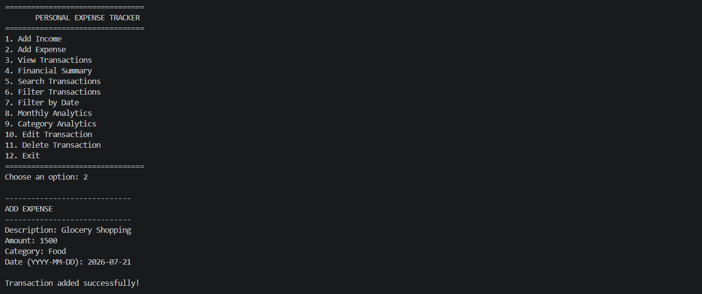
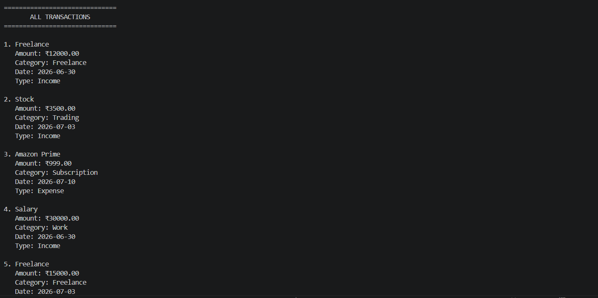

# Personal Expense Tracker

A Python-based personal finance application designed to help users manage income, expenses, transactions, and financial insights through a simple command-line interface.

## Overview

Personal Expense Tracker allows users to record and manage their daily financial transactions in one place.

The application stores transaction data locally using JSON and provides tools for searching, filtering, editing, deleting, and analyzing financial records.

## Screenshots

### Main Menu


### Add Expenses



### Financial Summary


### Monthly Analytics


### Category Analytics



## Features

- Add income
- Add expenses
- View all transactions
- Search transactions
- Filter transactions
- Filter transactions by date
- View financial summary
- View monthly analytics
- View category analytics
- Edit transactions
- Delete transactions
- Validate user input
- Store transaction data using JSON

## Financial Summary

The application calculates:

- Total income
- Total expenses
- Current balance

The balance is calculated based on total income and total expenses.

## Analytics

The application provides basic financial insights including:

- Monthly transaction analysis
- Category-based expense analysis
- Income and expense comparison
- Overall financial balance

## Future Improvements

- Add a graphical user interface
- Add data visualization with charts
- Add budget planning and tracking
- Add recurring income and expense support
- Add CSV export and import
- Add advanced financial reports
- Add improved transaction categorization

## Installation

### 1. Clone the Repository

```bash
git clone https://github.com/Varun313/personal-expense-tracker.git
cd personal-expense-tracker
```

### 2. Create a Virtual Environment

```bash
python -m venv venv
```

### 3. Activate the Virtual Environment

Windows PowerShell:

```powershell
venv\Scripts\activate
```

### 4. Run the Application

```bash
python app.py
```

No external Python packages are required because the project uses Python's built-in libraries.

## Usage

After starting the application, choose an option from the main menu:

1. Add Income
2. Add Expense
3. View Transactions
4. Financial Summary
5. Search Transactions
6. Filter Transactions
7. Filter by Date
8. Monthly Analytics
9. Category Analytics
10. Edit Transaction
11. Delete Transaction
12. Exit

Transaction data is stored locally in JSON format.

## Technology Stack

- Python
- JSON
- Git
- GitHub
- VS Code

## Project Structure

```text
Personal Expense Tracker
│
├── app.py
├── README.md
├── LICENSE
├── requirements.txt
├── .gitignore
│
├── screenshots/
│   ├── main-menu.png
│   ├── expenses-menu.png
│   ├── financial-summary.png
│   ├── monthly-analytics.png
│   └── transaction-summary.png
│
├── data/
│   └── expenses.json
│
├── ui/
│   ├── analytics.py
│   ├── dashboard.py
│   └── transactions.py
│
└── utils/
    ├── calculations.py
    ├── storage.py
    └── validators.py
```

## License

This project is licensed under the MIT License.